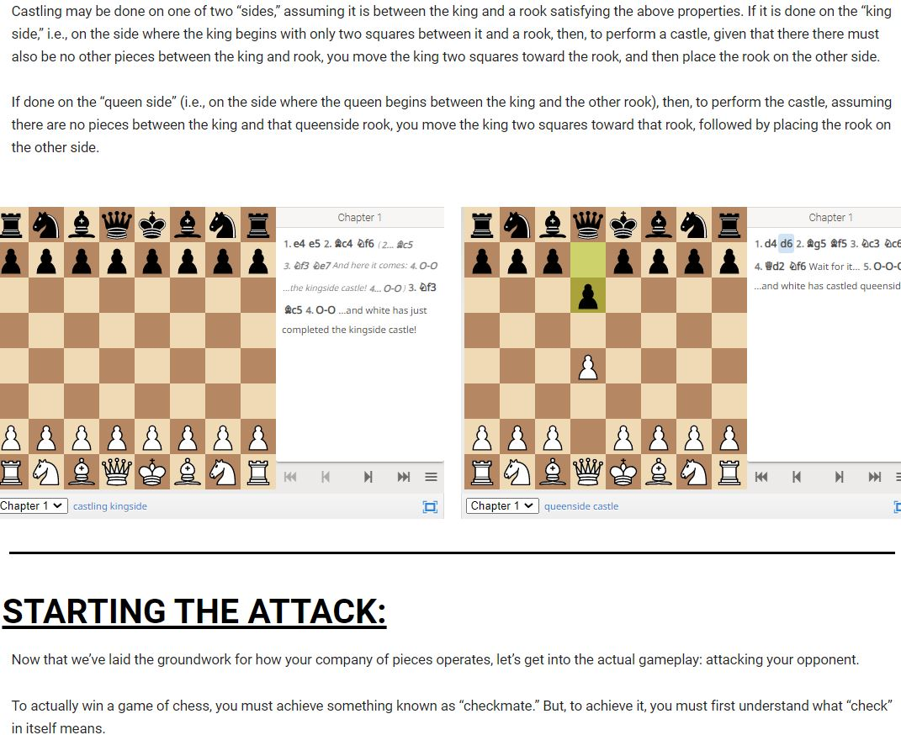

# Misha Reswick
<!-- Personal page for CSE 110 Lab #1-->

## **Bio**:

I am currently a Computer Science (B.S.) major at the *University of California - San Diego (UCSD)*, with interests in seeing how the physical and virtual worlds interact.

In addition, when I am not coding or tackling algorithmic challenges, I may be found with my camera ([see below](#photography-assignment-photo-sample)), tutoring students in math, science, and coding, or eagerly reading of and experimenting with the next technology I wish to use.

**Inspirations**:

 - *"Courage is what it takes to stand up and speak. Courage is also what it takes to sit down and listen." - Winston Churchill*

 - `do { try() && tryAgain()} while(true);`

 - 
     - [x] From brilliance to idea;
     - [x] from idea to code;
     - [x] from code to debugger;
     - [x] bug found;
     - [x] from code to brilliance;
     - [x] program crash;
     - [ ] brilliance restored;
     - [x] success;
     - [x] from twilight to bed, to learning we are led. 

## Links: ##
**LinkedIn**: [Education + Experiences](https://www.linkedin.com/in/misha-reswick-165120203/) 

### **Skills**:
*Languages*: Java, C/C++, Python, MATLAB, Arduino, HTML/CSS, ARM Assembly, R
*Tools/Environments*: Unix (Terminal), Shell Scripting, Git, Java Collections, C++ STL, Wordpress + Elementor, Excel, Photoshop, DaVinci Resolve

### **Projects**: 
 - *ECE 16 Selected Course Projects (Spring  2021):* 
    - Developed machine learning heart-rate monitor with Arduino
    ([see here](https://www.youtube.com/watch?v=X0k_LtSor88&list=PL3qJGVRBDkExvmZ5X_27Q15QPZ0Y5w5Uc&index=1)).
    - Built and coded controller for self-improved video games ([see first photo below](#photos-and-excerpts-from-projects)).
 - *CSE 100 Selected Course Project (Winter 2021):*
   - Implemented Huffman Encoding bitwise using tree shape.
 - *CAT 125R Selected Course Project (Winter 2021):*
   - Created WordPress website chessforall.space for introductory chess with embedded chess board instruction.
 - *mishamath.org (Fall 2018 - Winter 2020):*
   - Developed and maintained website with self-made Calculus and Physics tutorial videos.
 - *TETRIX Robotics + Java LeJos (2019):*
   - Programmed and built map-making robot using servos, ultrasonic sensors, PID control, and geometric calculation.

### Photos and Excerpts from Projects:
 - [ECE16 Video Game Controller](images/Misha_ECE16_FinalChallenge_VideoGameController_1.JPG)
 - *chessforall.space sample images*:
   - 
    - 

### Photography Photo Sample:
Below are a couple experimental sample photographs I took and edited in Adobe Photoshop for *Vis 60 (Spring 2021)*. Enjoy.
 1. Car Headlight, Abstract: 

 2. Water Glass, Conceptual:

  